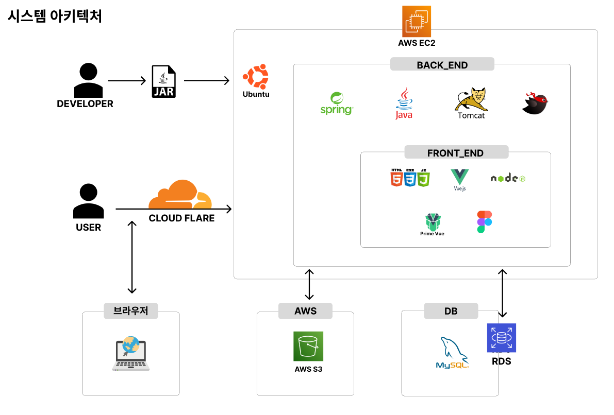
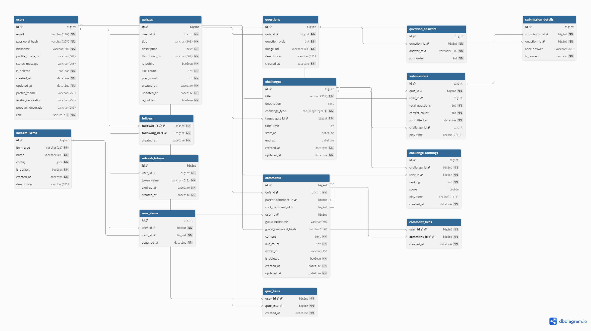

# 📸 Problem.io — 이미지 기반 퀴즈 플랫폼


- Problem.io는 **이미지 한 장으로 직관적·시각적인 퀴즈를 만들고 풀 수 있는 UGC 기반 플랫폼**입니다.
- Google Gemini 기반의 **생성형 AI(GenAI)** 기술을 도입하여 퀴즈 제작 경험을 혁신하고, 좋아요·팔로우·댓글 등 **SNS형 상호작용**을 통해 제작자와 플레이어가 자연스럽게 연결되는 커뮤니티를 지향합니다.

## 주요 기능 (Key Features)

### 1) AI 자동 썸네일 생성
- **Gemini 2.0 Flash** 모델 연동
- 퀴즈 제목과 설명만 입력하면 AI가 최적의 썸네일 2장을 즉시 생성 (Cinematic/Vibrant 스타일)
- 사용자는 마음에 드는 스타일을 선택하여 바로 적용 가능

### 2) 직관적인 퀴즈 제작
- 이미지 업로드 및 보기(객관식) 설정
- 복수 정답 처리 및 트랜잭션 기반의 안전한 저장
- 공개/비공개 설정 지원

### 3) 퀴즈 풀이 & 즉시 피드백
- 이미지 중심의 몰입감 있는 UI
- 정답 선택 시 즉시 O/X 피드백 및 해설 제공
- 최종 점수 및 소요 시간 기록

### 4) 소셜 커뮤니티 (SNS-like)
- **좋아요 & 댓글**: 퀴즈에 대한 반응과 의견 공유
- **팔로우 & 피드**: 관심 있는 제작자를 팔로우하고 새 퀴즈를 피드에서 확인
- **마이페이지**: 내가 푼 퀴즈, 만든 퀴즈, 팔로우 내역 등을 한눈에 관리

## 아키텍처 & 스택 (Tech Stack)
 

### Backend
- **Core**: Spring Boot 3.5, JDK 17
- **Security**: Spring Security + JWT (Stateless Authentication)
- **Persistence**: MyBatis (Complex Query Control), MySQL
- **AI Service**: **Google Gemini 2.0 Flash** (via GMS), **Caffeine Cache** (Temporary Image Storage)
- **Infra**: AWS S3 (Image Storage), Google SMTP (Email Auth)

### Frontend
- **Framework**: Vue 3 + Vite
- **State Management**: Pinia (Store)
- **UI Component**: PrimeVue, Tailwind CSS (Custom)
- **Network**: Axios (Interceptors for Auto-JWT Injection)

### DB
 
## 프로젝트 구조

```
ProblemIO/
├─ frontend/       # Vue 3 + Vite Client
│  ├─ src/api      # API Services (Axios)
│  ├─ src/components
│  │  ├─ layout    # Header, NavBar, Sidebar
│  │  ├─ common    # Shared UI Components
│  │  ├─ quiz      # Quiz Playing Widgets
│  │  └─ comment   # Comment & Reply System
│  ├─ src/views    # Page Routings
│  │  ├─ auth      # Login / Register
│  │  ├─ quiz      # List / Create / Solve / Result
│  │  ├─ user      # Profile / MyPage
│  │  └─ challenge # Ranking & Challe용
